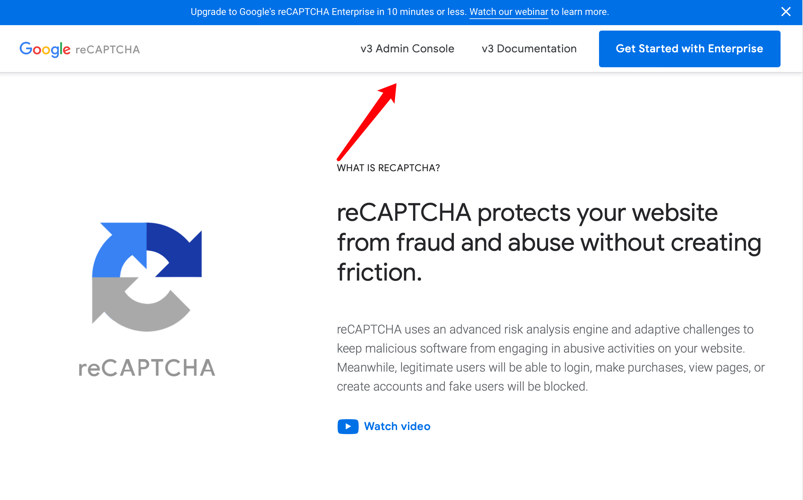
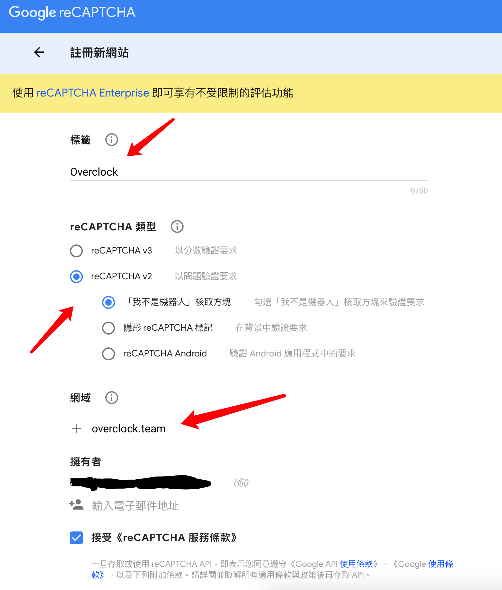
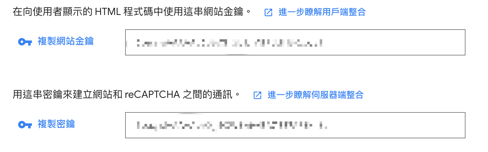

# How to use reCaptcha
## Overview
Google reCaptcha官网：[reCaptcha](https://www.google.com/recaptcha/about/)

在官网中点击`v3 Admin Console`，建立一个新网站:



如图填入标签、域名、类型:



建立完成后，将会得到`site key`和`private key`:



::: danger
必须严格保密private key
:::

## 前端使用
### 在网页中加入reCaptcha
```html
  <div 
    class="g-recaptcha" data-sitekey="site-key" 
    data-callback="handleReCaptcha">
  </div>
```
`data-sitekey`属性中需要填入`site key`。`data-callback`为验证成功时的回调。

```js
function handleReCaptcha(token) {
  // The g-recaptcha-response token
  console.log(token)
}
```
在js或者表单中可以拿到验证成功时的`g-recaptcha-response token`

在请求需要验证码的api时，请求中携带此字段，交给后端进行校验。

### APIs
参考 https://developers.google.com/recaptcha/docs/display

## 后端校验
后端接收到需要进行校验的请求后，向reCaptcha进行校验。

### Request
```
POST https://www.recaptcha.net/recaptcha/api/siteverify
```

### Request Body
| POST Parameter | Description                                                                                       |
|----------------|---------------------------------------------------------------------------------------------------|
| secret         | Required. The shared key between your site and reCAPTCHA.                                         |
| response       | Required. The user response token provided by the reCAPTCHA client-side integration on your site. |
| remoteip       | Optional. The user's IP address.                                                                  |

### Reponse
The response is a JSON object:
```json
{
  "success": true|false,
  "challenge_ts": timestamp,  // timestamp of the challenge load (ISO format yyyy-MM-dd'T'HH:mm:ssZZ)
  "hostname": string,         // the hostname of the site where the reCAPTCHA was solved
  "error-codes": [...]        // optional
}
```

### Error code reference
| Error code             | Description                                                                     |
|------------------------|---------------------------------------------------------------------------------|
| missing-input-secret   | The secret parameter is missing.                                                |
| invalid-input-secret   | The secret parameter is invalid or malformed.                                   |
| missing-input-response | The response parameter is missing.                                              |
| invalid-input-response | The response parameter is invalid or malformed.                                 |
| bad-request            | The request is invalid or malformed.                                            |
| timeout-or-duplicate   | The response is no longer valid: either is too old or has been used previously. |